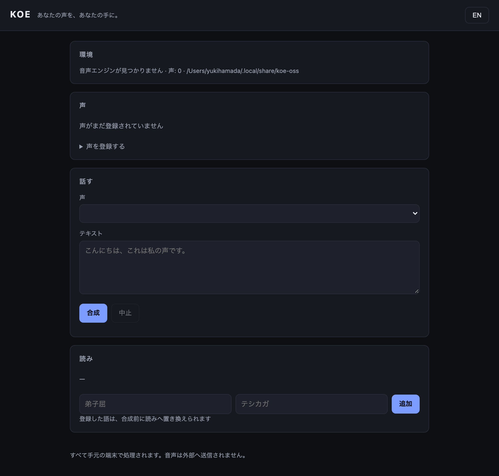

# KOE OSS

**あなたの声を、あなたの手元に。**
**Your voice. On your device.**

声のクローンも、文字起こしも、すべてあなたのMacの中で完結します。
録音はどこにも送信されません。

Voice cloning and transcription, entirely on your Mac.
Nothing is uploaded. Nothing leaves the machine.



---

## これで何ができるか / What it does

| | |
|---|---|
| 🎙 **声を登録** | 録音とその書き起こしから、あなたの声を作ります |
| 🔒 **同意の管理** | 同意するまで合成できません。取り消しもできます |
| 📖 **読みの修正** | 「弟子屈」を「テシカガ」と読ませる。一度直せば永続します |
| 📝 **長文の合成** | 途中で止まっても、続きから再開します |
| 🎧 **文字起こし** | 音声をテキストに。これもオンデバイスです |
| 📱 **iPhoneから使う** | LAN経由でiPhoneがMacの声を使えます。録音は送信されません |

---

## インストール / Install

### デスクトップアプリ（macOS・Apple Silicon）

```bash
brew install yukihamada/koe/koe-oss
open -a /Applications/KOE.app
```

### CLI

```bash
git clone https://github.com/yukihamada/koe-oss && cd koe-oss
pip install -e ".[dev]"
pip install mlx-audio mlx-whisper
koeoss doctor
```

> コマンドは **`koeoss`** です。`koe` は先手（Sente）が既に使っているため、
> 乗り換える名前にしませんでした。

---

## 使い方 / Usage

### 1. 声を登録して話させる

```bash
koeoss enroll yuki ~/my-voice.wav --text "録音で話した内容"
koeoss consent yuki
koeoss say yuki "こんにちは、これは私の声です。"
```

同意するまで合成できません。これは仕様です。

### 2. 読みを直す（一度で永続）

```bash
koeoss set-reading 弟子屈 テシカガ
koeoss say yuki "弟子屈は北海道にある静かな村です。"
# 辞書はモデルに確実に届きます（出力が変わります）。
# ただし望み通りの読みになる保証はありません。
# 実測では「テシカ川」となり、間違い方が変わりました。詳細は docs/STATUS.md。
```

### 3. 長文を合成する（中断しても再開）

```bash
koeoss speak-file yuki book.txt --out ./book
```

### 4. 文字起こし

```bash
koeoss transcribe recording.wav
# こんばんは濱田裕樹です。今日は録音ボタンを押して収録しています。

koeoss transcribe recording.wav --json
# {"text": "...", "language": "ja", "seconds": 3.69}
```

### 5. APIとして使う（127.0.0.1 のみ）

```bash
koeoss serve
```

```bash
curl -X POST http://127.0.0.1:8807/transcribe \
  -H 'Content-Type: application/json' \
  -d '{"path": "recording.wav"}'
```

外へは開きません。`/audio` と `/transcribe` はデータディレクトリの外にある
ファイルを拒否します。

---

## 実測値 / Measured

Apple M5 Max で計測しました。

| | |
|---|---|
| 音声合成モデル | `mlx-community/Qwen3-TTS-12Hz-0.6B-Base-bf16` |
| モデル読み込み | 18.97 秒 |
| ピークメモリ | 6.6 GB |
| リアルタイム係数 | 短い文で 約0.26 |
| 文字起こしモデル | `mlx-community/whisper-large-v3-turbo` |
| 文字起こし | 8.26秒の音声を 3.6秒 |

---

## 設計の方針 / Design

- **同意が先。** 声は本人のものです。同意記録がなければ合成しません。
- **できないことは、できないと言う。** 非対応の言語を、こっそり別の声に
  差し替えることはしません。理由を返して拒否します。
- **読みは提案し、人間が確定する。** 自動で書き換えて「直った」ことに
  しません。
- **録音は外に出ない。** ネットワーク越しの合成も、LAN内のペアリングまで。

---

## ⚠️ 署名について / Signing

配布しているアプリは**未署名**です。Developer ID証明書が手元にないため、
Gatekeeperが起動をブロックします。

Homebrewのcaskと `scripts/install.sh` は `com.apple.quarantine` を外すことで
これを回避します（ブロックの正体は署名ではなくこの属性です）。

正しく配布するには：

```bash
./scripts/sign.sh check   # 今の環境で何ができるか
./scripts/sign.sh sign    # 署名＋公証（Developer IDが必要）
```

証明書はAppleアカウントに存在しますが、秘密鍵がこのMacにありません。
新規作成には Account Holder 権限が必要です。

---

## 制約 / Limitations

- アプリが未署名（上記参照）
- Apple Silicon のみ。Intel Mac・Windows・Linuxは未検証
- 日本語のみ end-to-end で検証済み
- 音声合成は0.6Bモデルのみ計測
- 合成は同期処理。長い文はリクエストをブロックします

---

## 検証 / Verification

```
172 tests (pytest) ・ CI 8/8 jobs
CI 8/8 jobs green
```

---

## ライセンス / License

AGPL-3.0. See [LICENSE](LICENSE).

音声のクローンを本人の同意なしに行わないでください。
Do not clone a voice without its owner's consent.
